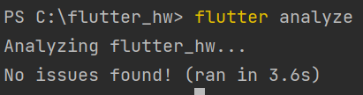
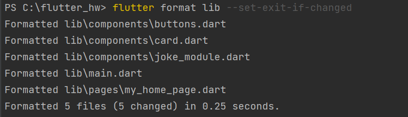

# Flutter. Chuck Norris Tinder App

This project is a tinder analogue with the jokes regarding Chuck Norris.

<!-- TABLE OF CONTENTS -->

  
Table of Contents

  <ol>
    <li>
      <a href="#about-the-project">About The Project</a>
    </li>
    <li><a href="#usage">Usage</a></li>
    <li><a href="#contributing">Contributing</a></li>
    <li><a href="#contact">Contact</a></li>
  </ol>

<!-- ABOUT THE PROJECT -->
## About The Project

This project is a Flutter App with "Chuck Norris"-related jokes.
The goal of the project is to get acquainted with Flutter (the use of http, Stateful and Stateless 
Widgets such as MaterialApp, Scaffold, SafeArea, Row, Padding, etc.) 
by creating the app with linters and Chuck Norris Jokes Api.
The joke is updated by pressing "like"/"dislike" buttons or by swiping in left/right directions.
Also, you can open the current joke in the browser by going to the option in the menu.
 

### Built With

* [![Flutter][Flutter.com]][Flutter-url]

### Format change and Linters

I have used flutter_lints - a set of recommended lints for Flutter 
apps, packages, and plugins designed to encourage good coding practices. 
Also, I have specified the additional set of rules regarding style, formatting and doc comments.
To apply the above-mentioned rules I used the following commands:

---------

<!-- USAGE EXAMPLES -->
## Usage

You can view a large set of jokes randomly obtained using the API.
The joke is updated by pressing "like"/"dislike" buttons or by swiping in left/right directions.
Also, you can open the current joke in the browser by going to that option in the menu.

<!-- CONTRIBUTING -->
## Contributing

If you have any comments which would make this project better,
please fork the repo and create a pull request.

1. Fork the Project
2. Create your Feature Branch (`git checkout -b feature/AmazingFeature`)
3. Commit your Changes (`git commit -m 'Add some AmazingFeature'`)
4. Push to the Branch (`git push origin feature/AmazingFeature`)
5. Open a Pull Request

<!-- CONTACT -->
## Contact

* Kseniya Evdokimova - k.evdokimova@innopolis.university
* Telegram - @KseniyaEv

Project Link: [https://github.com/KsEv13/devops.git](https://github.com/KsEv13/devops.git)

<!-- MARKDOWN LINKS & IMAGES -->
<!-- https://www.markdownguide.org/basic-syntax/#reference-style-links -->

[Flutter.com]: https://img.shields.io/badge/%20-Flutter-blue
[Flutter-url]: https://flutter.dev/
